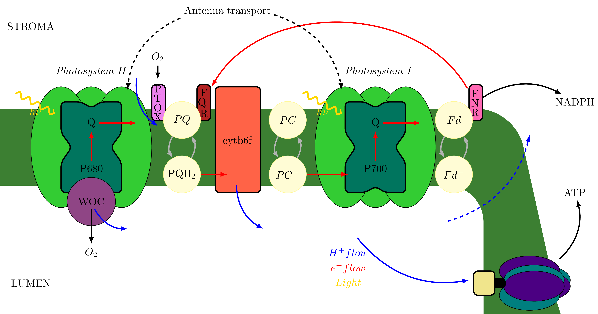
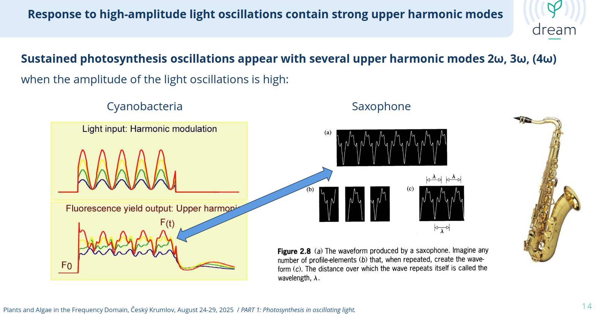

## The photosynthetic electron transport chain

Plants are converting H$_2$O and CO$_2$ into O$_2$ and glucose, respectively, via light energy through photosynthesis. This process is decomposed into: first the light-dependent reactions converting light energy into chemical energy (ATP) and reservoir of reducing power (NADPH), then the dark reaction responsible for the assimilation of CO$_2$ into glucose. We talk here about the first part which consists in a cascade of redox reaction in the photosynthetic electron transport chain (PETC). 

Photons hitting the antennas attached to the membrane of the chloroplasts are absorbed and create a flow of electrons through the PETC but a small portion of the energy is re-emitted through the chlorophyll fluorescence. It is possible to measure this fluorescence in response to light stimulation to probe especially the function of the Photosystem II (see figure below).The other components of PETC can be probed by measurement of the transmittance at certain wavelengths: the reactions centers of Photosystem I (P700) and the various redox pools (plastocyanine PC, or ferredoxin Fd) visible on the figure below.

{fig-cap="The photosynthetic electron transport chain (PETC) showing the flow of electrons from photosystem II (PSII) through the cytochrome b6f complex to photosystem I (PSI), with key components like plastocyanin (PC) and ferredoxin (Fd) indicated." fig-width="100%" fig-align="center"}

## Sonification of the PETC

It is possible to study such non-linear systems by sinewave stimulation and tracking harmonics in the response spectrum, higher harmonics being indicative of non-linearities in the system. Ladislav Nedbal in his [talk](https://ac-biology.com/wp-content/uploads/2025/09/2-Nedbal-123.pdf) at the DREAM workshop 2025 suggested, from visual inspection, that the waveform of the fluorescence he measured in response to oscillating light is similar to that of a saxophone. 

{fig-cap="Slide extracted from Ladislav's talk at the DREAM workshop 2025." fig-width="100%" fig-align="center"}

This sounded interesting to me so I decided to listen to the timber of the PETC through sonification of the various signals recorded in the study of Yuxi Niu and al. [@niu2023plants] on Arabidopsis thaliana plants exposed to oscillating light. 

For each of the observables (Light, Chlorohyll Fluorescence, PC, Fd and P700), I collected the cleaned waveform where only the first 4 harmonics were kept at various frequencies. I then rescaled the timeseries to a 440Hz signal and added a Hanning window to give a simple dynamics envelope. 

You can hear the result below. Except for the Light signal which is always a pure sine wave, the timber is quite different depending on the frequency...That's how photosynthesis sounds!

<video width="100%" controls>
  <source src="./Light_fit.mp4" type="video/mp4">
  Your browser does not support the video tag.
</video>

<strong>Light Signal</strong>

<video width="100%" controls>
  <source src="./Fluo_fit.mp4" type="video/mp4">
  Your browser does not support the video tag.
</video>

<strong>Chlorophyll Fluorescence</strong>

<video width="100%" controls>
  <source src="./PC_fit.mp4" type="video/mp4">
  Your browser does not support the video tag.
</video>

<strong>Plastocyanin (PC)</strong>

<video width="100%" controls>
  <source src="./Fd_fit.mp4" type="video/mp4">
  Your browser does not support the video tag.
</video>

<strong>Ferredoxin (Fd)</strong>

<video width="50%" controls>
  <source src="./P700_fit.mp4" type="video/mp4">
  Your browser does not support the video tag.
</video>

<strong>P700 Reaction Center</strong>

*The sound of photosynthesis at different frequencies* The curves are parametrized by the phase of the light excitation: $$R(\theta) = R_0+A(\theta)$$ where $A(\theta)$ is the waveform of the response.

I received useful comments from collaborators of the DREAM workshop 2025, in particular from Ladislav Nedbal, Dusan LAzar and Benjamin Bailleul. Thanks to them for their feedback.

## References

::: {#refs}
::: 