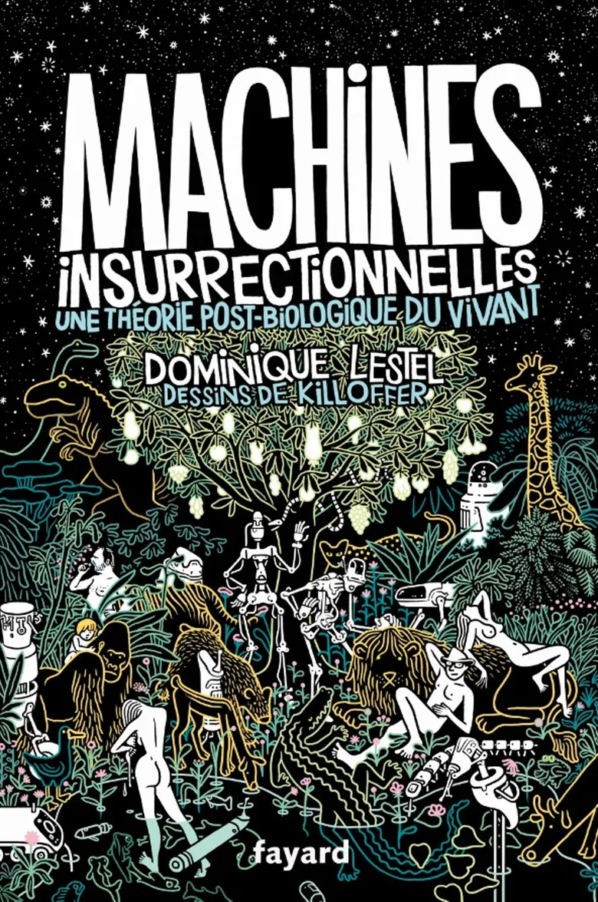
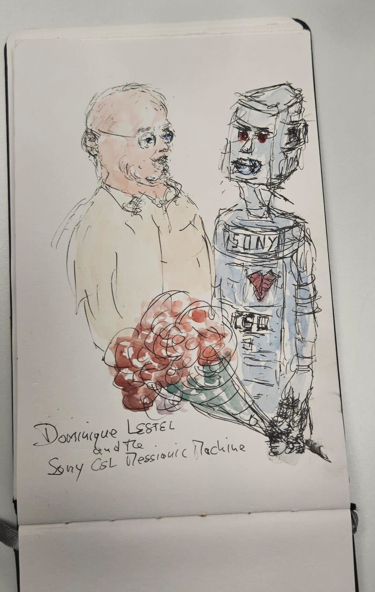

We had the great pleasure, at [AIPHI](https://ai-phi.github.io/), of hosting **Dominique Lestel**, who presented his work in a talk entitled *Steps to an Ethology of Insurrectionary Machines*. His presentation was based on his 2021 book, written from his experience as a field philosopher exploring robotics laboratories such as [Gentiane Venture’s lab](https://www.gvlab.jp/) at the University of Tokyo. The book, *Insurrectionary Machines – A Post-Biological Theory of the Living*, also features a comic strip by Killoffer running throughout the text.

{width=30% fig-align=center} 

  

Lestel argues that the rise of AI—and particularly humanoid robots—should prompt us to rethink who we are as humans and what we mean by “living agents.” Taking the example of **Sophia**, the robot that received Saudi Arabian citizenship, he highlights how these machines fulfill ambiguous needs and generate multiple effects that deserve scrutiny:

- Today’s humanoid robots are **messianic machines**, persuading us that we need them and that they could one day replace humans.

- They are also **metaphysical machines**, compelling us to ask fundamental questions—such as where the boundaries of the living truly lie.

- Humanoid robots are **conjuring machines**, far removed from the impersonal AGI expected by proponents of the technological singularity.

- These **machines disrupt the nature of language**, producing utterances detached from any clear frame of reference. When it becomes so easy to “speak from nowhere,” every act of speech can be called into question.

- They **destabilize our sense of what is human**: our morality and worldview shift when we can no longer tell whether we are interacting with a person or with something merely appearing to be human.

- Finally, they signal our entry into **existential capitalism**—a market of artificial companions designed to console us for being *only* human.

We need little encouragement to care about existential artifacts, as shown by our attachments to dolls, puppets, or tamagotchis. Redefining living agents through the experience of living with them—and forming hybrid communities alongside them—is a refreshing perspective. It is striking that the question of the human–non-human divide was traditionally posed when humans assumed their superiority over animals, whereas today, in the presence of machines, that superiority is far less certain.

Considering hybrid communities is also relevant in the broader context of extending intelligence to non-humans in nature—plants, microbes, or even rivers. Observing how agency circulates among these agents, humans, and machines will be a fascinating dance to follow.

{width=30%}

 

Below, you’ll find the recording of the session—unfortunately truncated by about 10 to 15 minutes due to a technical issue.

<audio controls>
  <source src="AIPHI_Dominique_LESTEL_cut.mp3" type="audio/mpeg">
  Your browser does not support the audio element.
</audio>

