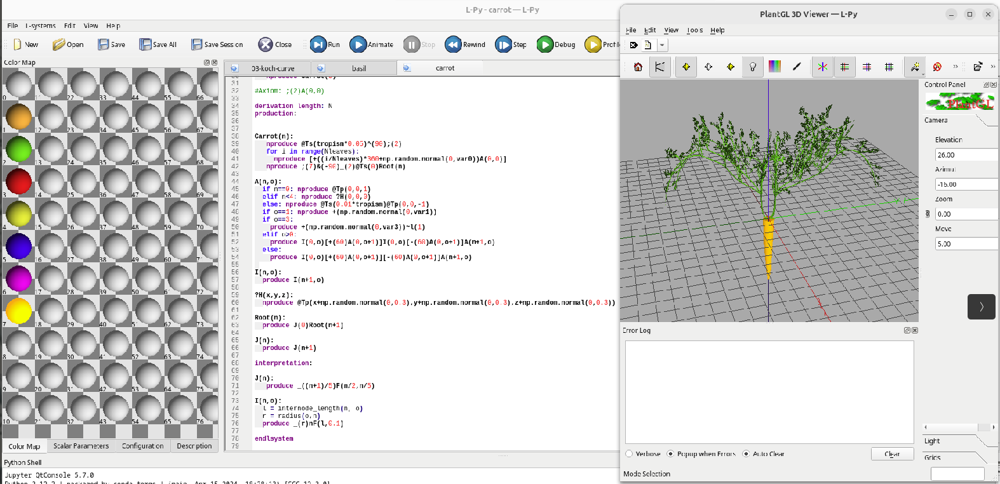
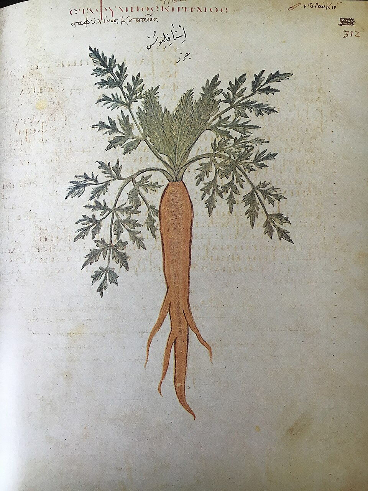
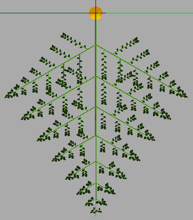
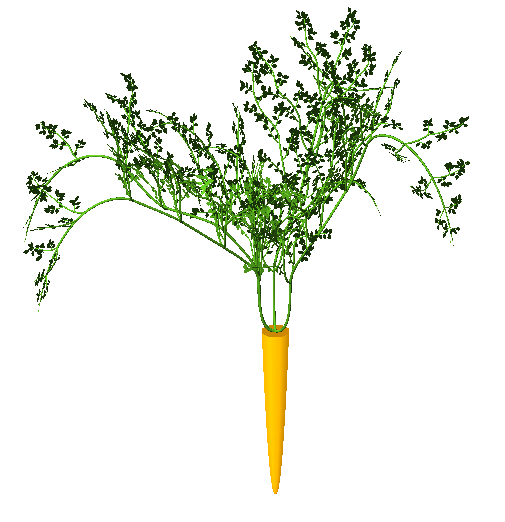
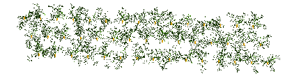

Carrots are quite tough to harvest by hand but there is a way to to do it without hurting your back or getting your hands dirty. Grow it virtually!

For modelling plants, there are L-system frameworks like [L-py](https://github.com/openalea/lpy)[@boudon2012py] which is a dialect of Python enabling the definition of L-systems and their simulation. 

{width=100%}

The first step is to observe a carrot plant and understand its structure. It is important to extract the rules along branching. For example, we can check the images below extracted from an old manuscript and see that each leaf from the root unfolds in a plane. Sub-leaves grow in pairs with opposite angles at level 1 and alternate on each side at the following levels of recursion. We need to translate these rules into an L-system and produce a single leaf. 

:::{.columns}
::: {.column width="47%"}
{width=100%}
:::
::: {.column width="53%"}
{width=100%}
:::
:::
 
Then, in order to produce more realistic plants, we add a stochastic component to the rules. For example, we can add a small random angle to the sub-leaves at each level of recursion. We also include an upward tropism so that the leaves have curvature. Here is an instance of the simulated plant.

{width=100%}

Finally, we can produce a field of carrots by generating a new random instance for each plant. Here is a visualization of the simulated field.

{width=100%}

The code is available on [GitHub](https://github.com/SonyCSLParis/CarrotFielsForever).

## References

::: {#refs}
::: 