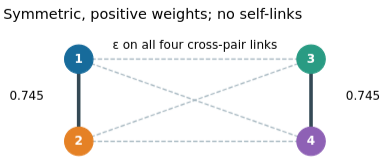

*Flipped-flop oscillatory networks.*

Some almost 20 years ago, I was at **Yoko Yamaguchi**'s Lab where I developped a new model of a flip-flop oscillator with a Milnor attractor. Together with her and **Colin Molter** we published a paper using such oscillators as a simple model of working memory dynamics. It was published in the journal Cognitive Neurodynamics [@colliaux2009working]. In this paper, we jump from the analysis of a 2 units network to simulations of a 80 units network. I always thought there was some interesting behavior to explore in the model with few units (3 or 4) but I never had an opportunity to do so.

](colin.png)

As such exploration is now easy with AI agents like Claude and ChatGPT, I decided to give it a try. Among the many interesting behaviors and anlysis which resulted from my prompt, I want to share the discovery of **hyperchaos** [@rossler1979equation] in the 4 units network. We consider a modular networt as described below: 

The network in this configuration has 2 positive Lyapunov exponents. It is a **hyperchaotic** system!

